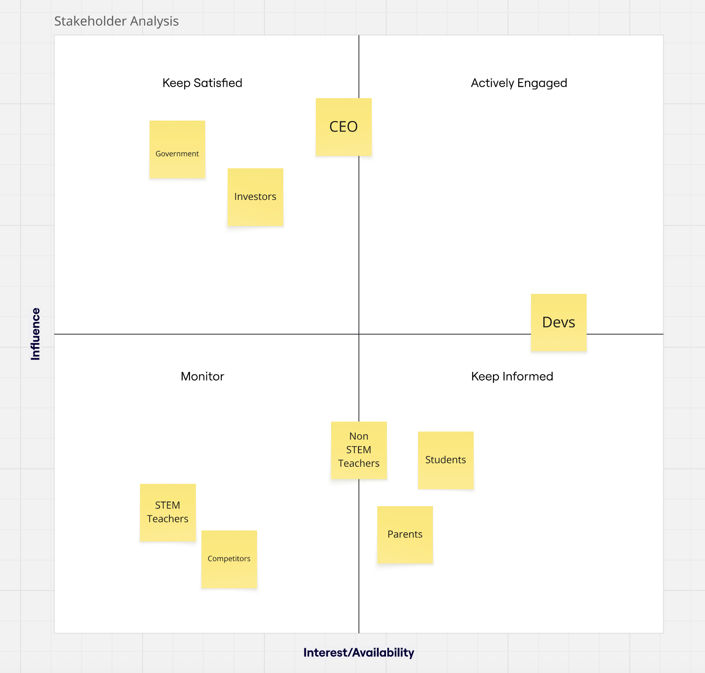
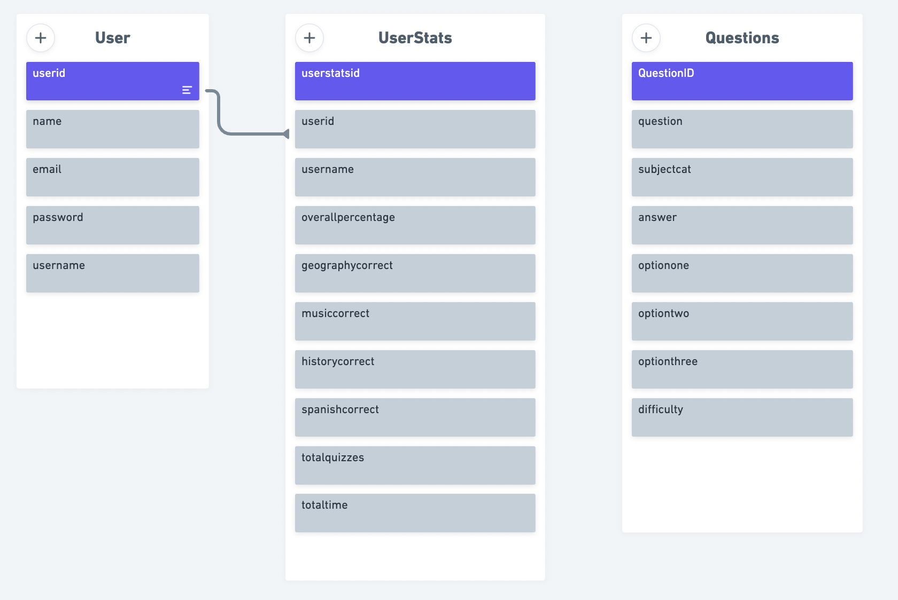
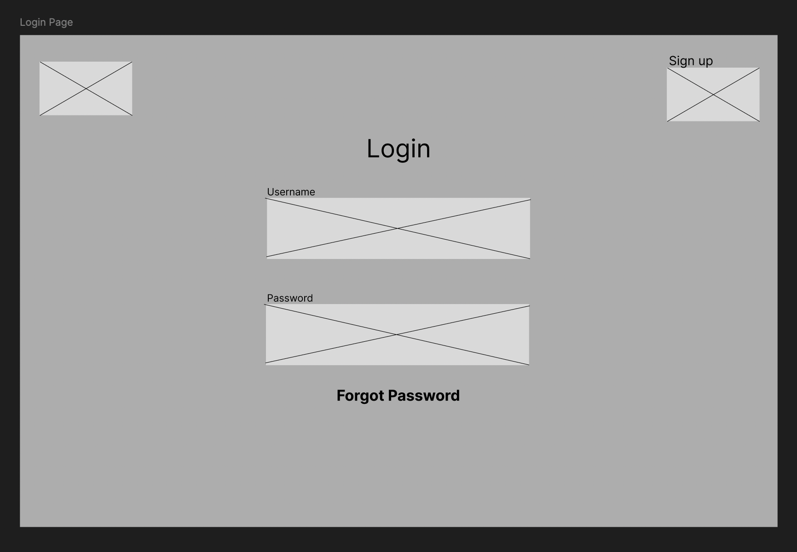
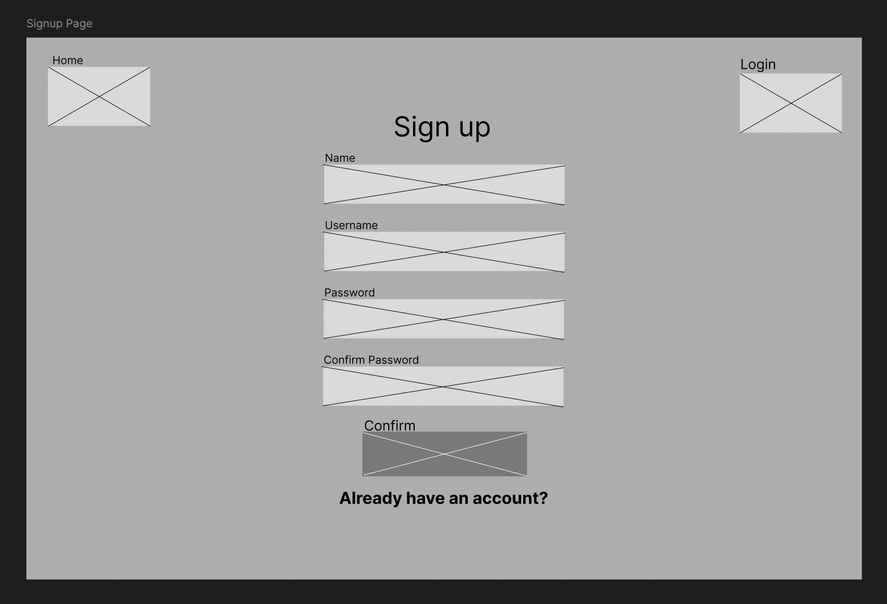
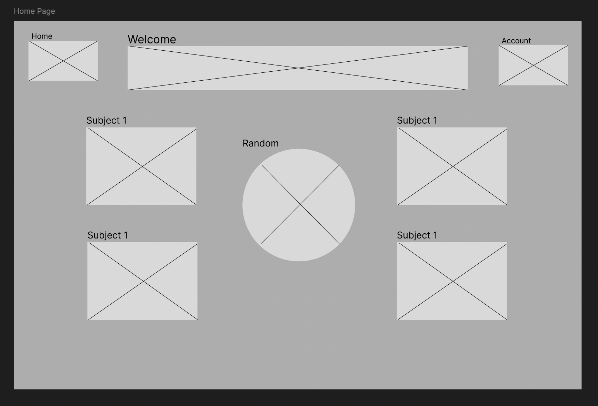
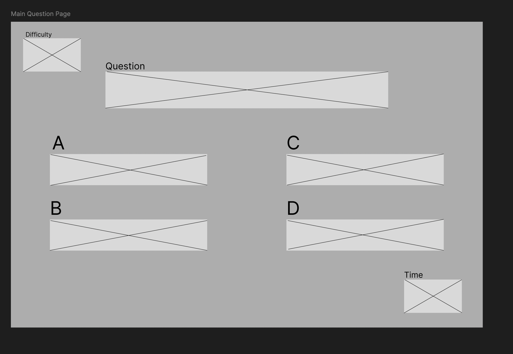
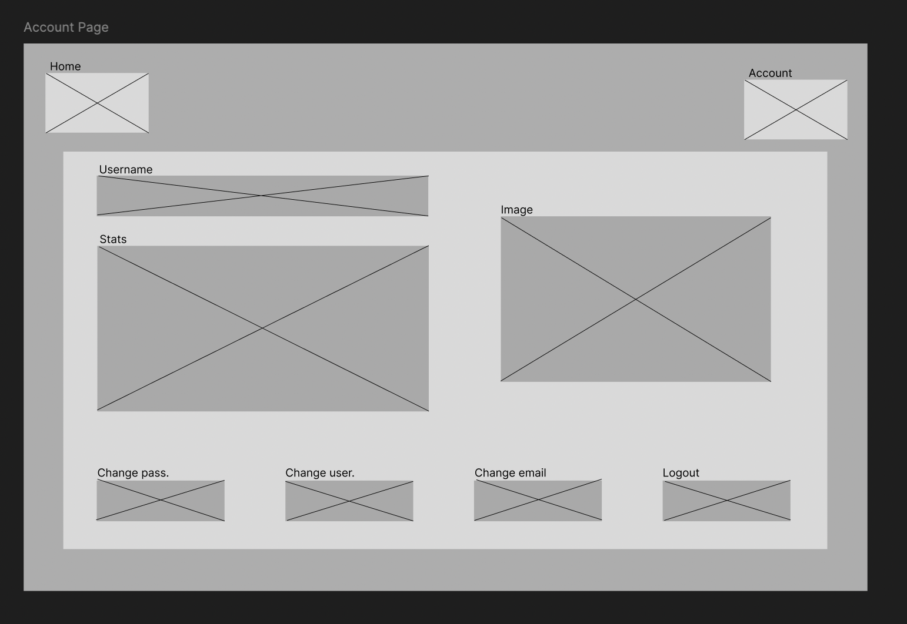
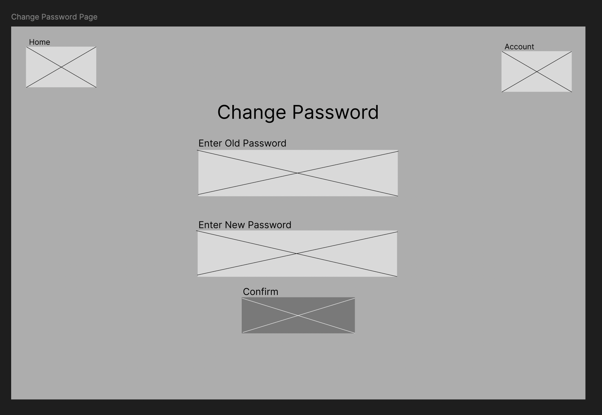

# MIAMY Alpha Project❗️

## Developers
[Max](https://github.com/maxshen01),
[Yuktha](https://github.com/yua10),
[Mehrab](https://github.com/Mehrab8832),
[Avkaran](https://github.com/avi17ak),
[Israel](https://github.com/b1uuye)

## Problem Statement

The management team of the Hive group of secondary schools has noticed a lack of engagement in non-STEM subjects over the last two years. They would like to try and reverse this trend and have asked an external team to come up with a solution that places student enjoyment at the heart of the learning experience.

## Application Solution Description

Our solution brings interactivty and learning together. The all-in-one quiz application focuses on quiz-based learning that allows students to focus on the lesser and more overlooked non-stem subjects such as geography, history etc. This engages students whilst also allowing them to see the fun in non-stem subjects.

## Stakeholder and Solutions analysis

### Stakeholder Analysis

| Stakeholder | Description | Reason |
| --- | --- | --- |
| CEO | Owner of the business | The CEO lies in the 'keep satisfied' region due to him having such high influence in the application. He is the one who decides on where resources are allocated, but also has a relatively big interest as he wants students to have a 'well-rounded, holistic education'. |
| Students | People studying at school | They fall in the 'keep informed' region as they are the people the application directly involves. They mention about wanting to learn different subjects. They are still higher in influence than parents and certain teachers as they are the people the app is being catered to. |
| Devs | People building the applications and software | They fall just inside 'actively engaged' due to their interest in the application but also their influence in the direction it goes. They are the people who will build, test and deploy the application to the best ability. |
| Government | In control of the government in the specific country | They are in the 'keep satisfied' region due to them being the overseers of anything education related. They have immense power with what can and can't be done in the country, but may not have as much interest due to an already formulated education syllabus. |

### Solutions Diagram

The Quiz system is the main system. The database feeds information and acts as a connection point towards the entire system. Teacher portals wil be able to manage and control the quiz sytem, whilst quiz templates are naturally generated from the information from the database.

From this a user will be able to log in or sign up and access full functionality such as engaging within the student homepage, account page and quiz selection pages. The quiz selection page will then bring a quiz from the generated quiz templates.

## Database Entity Relationship Diagram (ERD)

### Users Table
The users table holds vital information about the user with the primary key being the UserId. The other information within the table (name, username, email, password) is gained upon sign up to the application.

### UserStats Table
User stats table is closed linked to the Users table having UserId as a foreign key and UserStatsId as the main primary key for the table. With this it establishes a many to one relationship with the Users table as a user can have multiple different statistics.

### Questions Table

Questions table exists on its own as it is purely for storing all the relevant questions for for the different categories of non-stem subjects. The primary key inside this table is QuestionId which is used to locate different questions.

## Designs & Wireframes

| Name | Wireframe | Design | 
| --- | --- | --- |
| Login Page |  |  |
| Sign Up Page|  |  |
| Home Page |  |  |
| Main Question Page |  |  |
| Account Page |  |  |
| Change Information Page |  |  |

## Getting Started
[Backend Setup⚙️](https://github.com/avi17ak/project-alpha/tree/main/server)

[Frontend Setup🖥️](https://github.com/avi17ak/project-alpha/tree/main/client)